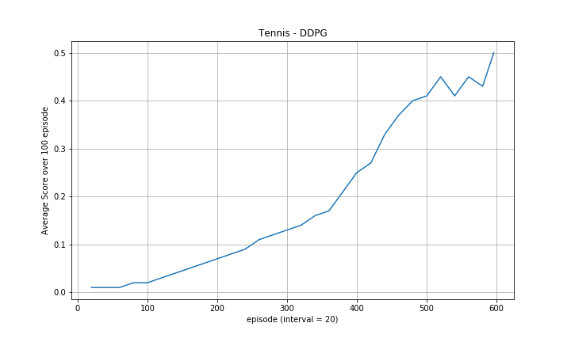

## Report
In the project we train a Deep Deterministic Policy Gradient (DDPG) agent to solve Unity Reacher environments. Please see the detail description of the environment in the **README**.                                                                                                                                                        
                                                                                                                                                                                                                                                                                                                                        
DDPG adapts the idea of Deep Q-Learning to continuous control problem. It is a model-free algorithm using actor-critic framework with deterministic policy gradient. DDPG is first published by Google DeepMind. For detail please see [this paper](https://arxiv.org/pdf/1509.02971.pdf).                                                       
                                                                                                                                                                                                                                                                                                                                                 
### Training Multiple DDPG Agent                                                                                                                                                                                                                                                                                                                 
Please run the follow notebooks to train two DDPG agents after setting up the environment:                                                                                                                                                                                                                                                       
- `Tennis.ipynb` for learning two agents using the Tennis environment, which contains 2 agents playing Tennis.                                                                                                                                                                                                                                   
- `multi_ddpg_agent.py` file is called in the notebook to initialize multiple DDPG agents, and train the agent's actor and critic network.                                                                                                                                                      
- `buffer.py` contains the code for replay memory buffer.
- `noise.py` includes the code for Ornstein–Uhlenbeck noise.
- The neural network models are in the `model.py` file. Both actor and critic network are 2 layer fully connected network with [512,384] units.
- Hyperparameters are set in the `Tennis.ipynb` as follows: 

````
params['buffer_size'] = int(1e5)
params['batch_size'] = 256
params['gamma'] = 0.99
params['tau'] = 3e-1
params['lr_actor'] = 1e-4
params['lr_critic'] = 1e-4
params['weight_decay'] = 0
````                                                                                                                                                                                               
The target network update parameter tau is set quite high here to help speed up the training time.                                                                                                                                                                                                                                                                                                                                              

In `Tennis.ipynb` we are able to solve the environment (get an average score of 0.5 over 100 consecutive episodes) after 596 episodes using **DDPG** algorithm.                        
*Note: The code is adapted from Udacity DRLND DDPG examples.*                                                                                                                                                                                                                                                                                    
                                                                                                                                                                                                                                                                                                                                                 
#### Result plot                                                                                                                                                                                                                                                                                                                                     
Plot of reward over episode (solved at 596):                                                                                                                                                                                                                                                                                                                     
                                                                                                                                                                                                                                                                                                                                                 
 

The score shown in the figure is an average over 100 episode, where the interval of recording is 20 episodes.                                                                                                                                                                                                                                                                                                                        

**Output during training:**   
````                                                                                                                                                                                                                                                                                                                                                                                                                                                                                                                                                                                                                                                            
Episode 20	Score: 0.01 	Average Score: 0.01
Episode 40	Score: 0.01 	Average Score: 0.01
Episode 60	Score: 0.03 	Average Score: 0.01
Episode 80	Score: 0.03 	Average Score: 0.02
Episode 100	Score: 0.03 	Average Score: 0.02
Episode 120	Score: 0.05 	Average Score: 0.03
Episode 140	Score: 0.05 	Average Score: 0.04
Episode 160	Score: 0.07 	Average Score: 0.05
Episode 180	Score: 0.07 	Average Score: 0.06
Episode 200	Score: 0.10 	Average Score: 0.07
Episode 220	Score: 0.11 	Average Score: 0.08
Episode 240	Score: 0.11 	Average Score: 0.09
Episode 260	Score: 0.15 	Average Score: 0.11
Episode 280	Score: 0.11 	Average Score: 0.12
Episode 300	Score: 0.15 	Average Score: 0.13
Episode 320	Score: 0.16 	Average Score: 0.14
Episode 340	Score: 0.22 	Average Score: 0.16
Episode 360	Score: 0.23 	Average Score: 0.17
Episode 380	Score: 0.27 	Average Score: 0.21
Episode 400	Score: 0.35 	Average Score: 0.25
Episode 420	Score: 0.28 	Average Score: 0.27
Episode 440	Score: 0.53 	Average Score: 0.33
Episode 460	Score: 0.41 	Average Score: 0.37
Episode 480	Score: 0.45 	Average Score: 0.40
Episode 500	Score: 0.36 	Average Score: 0.41
Episode 520	Score: 0.52 	Average Score: 0.45
Episode 540	Score: 0.29 	Average Score: 0.41
Episode 560	Score: 0.62 	Average Score: 0.45
Episode 580	Score: 0.36 	Average Score: 0.43

Environment solved in 596 episodes!	Average Score: 0.50
````                                                                                                                                                                                                                                                                                                                                              
                                                                                                                                                                                                                                                                                                                                                                                                                                                                                                                                                                                                                    
                                                                                                                                                                                                                                                                                                                                                 
### Future work                                                                                                                                                                                                                                                                                                                                  
- DDPG training is slow, as future work further tuning hyperparapmeters and noise parameters can speed up the training process. 
- For future work, I will also look into implementing Multi-agent DDPG (MADDPG). For details, please see this paper: https://arxiv.org/abs/1706.02275
- Some other algorithms (e.g. [PPO](https://arxiv.org/abs/1707.06347) ) for continous control can also be integrated.                                                                                                                                                                                                                                                                                                               